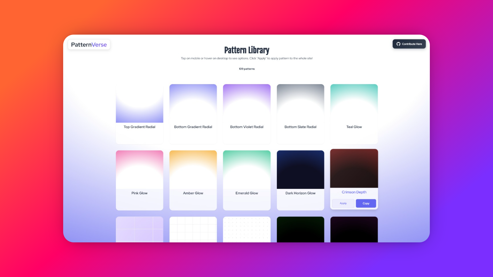
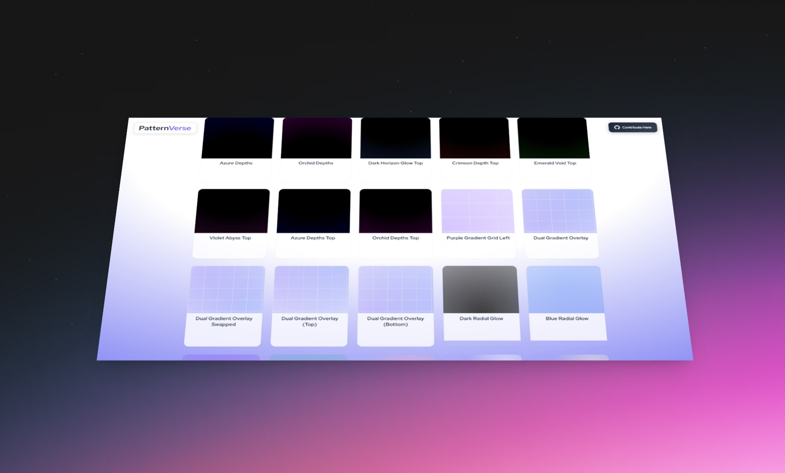
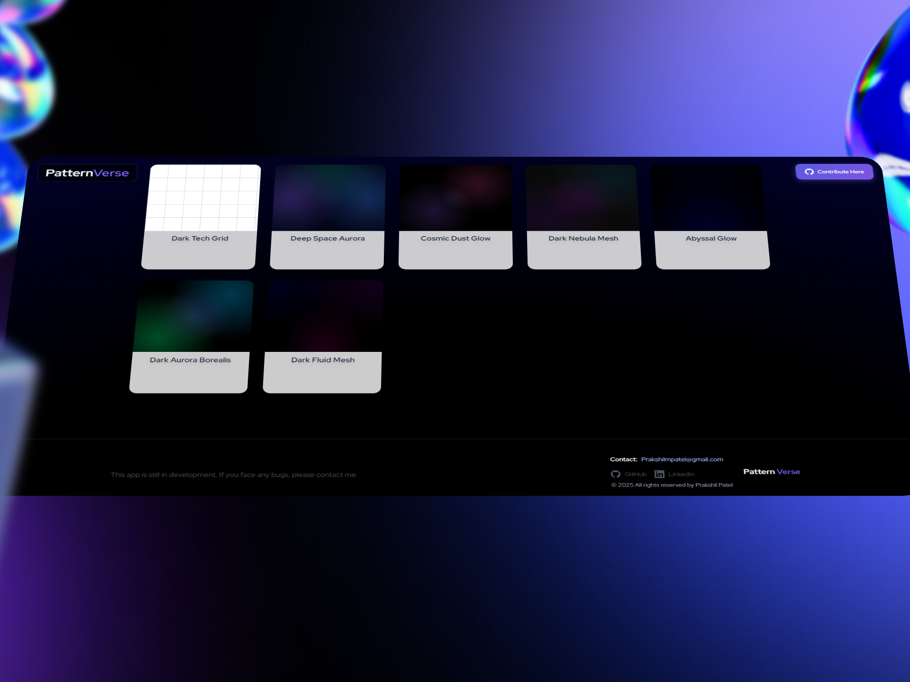

# 🎨 PatternVerse
**Stunning Backgrounds for your next big thing!**

<div align="center">


**The Ultimate CSS Pattern Background Library**

*Create, explore, and implement stunning CSS patterns with ease.*

[](https://github.com/Prakshil/PatternVerse)
[](https://your-demo-link.com)
[](./LICENSE)
[](https://github.com/Prakshil/PatternVerse)

</div>

---

## 🚀 What is PatternVerse?

PatternVerse is a modern, open-source web application that empowers developers and designers to create, explore, and implement beautiful CSS pattern backgrounds effortlessly. With an intuitive interface and extensive pattern library, it's the perfect tool for adding visual flair to your projects.

### ✨ Key Features

- 🎯 **50+ Handcrafted Patterns** - Carefully designed gradients, geometric shapes, and textures
- 🔥 **Live Preview** - See patterns in action with real-time application
- 📋 **One-Click Copy** - Ready-to-use CSS code with instant clipboard functionality
- 🎨 **Apply to Site** - Test patterns directly on the application interface
- 📱 **Fully Responsive** - Perfect experience across all devices
- ⚡ **Zero Dependencies** - Pure CSS patterns with Tailwind CSS integration
- 🌙 **Dark/Light Themes** - Automatic theme detection based on pattern selection
- 🎪 **Multiple Categories** - Gradients, geometric patterns, textures, and more

---

## 🖼️ Screenshots

### Pattern Library Overview

*Browse through our extensive collection of patterns with hover effects and real-time previews*

### Live Pattern Application

*Apply patterns instantly to see how they look on your site with the interactive preview feature*

### Code Export & Copy

*Get clean, production-ready CSS code with one click - perfect for immediate implementation*

---

## 🛠️ Built With

<div align="center">

| Technology | Purpose | Version |
|------------|---------|---------|
|  | Frontend Framework | 18.x |
|  | Styling Framework | 3.x |
|  | Programming Language | ES6+ |
|  | Pattern Generation | 3.0 |

</div>

---

## 🚀 Quick Start

### Prerequisites

- Node.js (v14 or higher)
- npm or yarn package manager

### Installation

1. **Clone the repository**
   ```bash
   git clone https://github.com/Prakshil/PatternVerse.git
   cd PatternVerse
   ```

2. **Install dependencies**
   ```bash
   npm install
   # or
   yarn install
   ```

3. **Start development server**
   ```bash
   npm start
   # or
   yarn start
   ```

4. **Open your browser**
   ```
   Navigate to http://localhost:3000
   ```

### Build for Production

```bash
npm run build
# or
yarn build
```

---

## 🎯 How to Use

### 1. Browse Patterns
- Explore the pattern library with categories like gradients, geometric, and textures
- Hover over patterns to see interactive preview options

### 2. Preview Patterns
- Click "Apply" to see how the pattern looks as a full-page background
- Use "Copy" to get the CSS code for your projects

### 3. Implement in Your Project
- Copy the provided CSS code
- Paste it into your stylesheet or component
- Customize colors, sizes, and opacity as needed

### 4. Code Examples

```css
/* Gradient Pattern */
.gradient-background {
  background: linear-gradient(45deg, #667eea 0%, #764ba2 100%);
}

/* Grid Pattern */
.grid-background {
  background-image: 
    linear-gradient(to right, rgba(156, 163, 175, 0.1) 1px, transparent 1px),
    linear-gradient(to bottom, rgba(156, 163, 175, 0.1) 1px, transparent 1px);
  background-size: 24px 24px;
}

/* Radial Glow Pattern */
.radial-glow {
  background: radial-gradient(circle at center, 
    rgba(139, 92, 246, 0.3) 0%, 
    transparent 50%);
}
```

---

## 🤝 Contributing

We welcome contributions from the developer community! PatternVerse is open-source and thrives on collaboration.

### Ways to Contribute

- 🎨 **Add New Patterns** - Create and submit beautiful new CSS patterns
- 🐛 **Bug Fixes** - Help improve the application's stability
- ✨ **Feature Enhancements** - Suggest and implement new features
- 📖 **Documentation** - Improve guides and documentation
- 🧪 **Testing** - Help with testing across different browsers and devices

### Contribution Process

1. Fork the repository
2. Create a feature branch (`git checkout -b feature/amazing-pattern`)
3. Add your pattern to `src/data/patterns.js`
4. Test your changes thoroughly
5. Commit your changes (`git commit -m 'Add amazing new pattern'`)
6. Push to the branch (`git push origin feature/amazing-pattern`)
7. Open a Pull Request

### Pattern Contribution Guidelines

```javascript
// Pattern Template
{
  id: "unique-pattern-id",
  name: "Pattern Display Name",
  category: "gradients|geometric|textures|effects",
  badge: "New", // Optional
  css: "your-css-pattern-here",
  backgroundSize: "optional-background-size", // Optional
  code: `<div class="example-implementation">...</div>` // Optional
}
```

---

## 📁 Project Structure

```
PatternVerse/
├── public/
│   ├── index.html
│   ├── manifest.json
│   └── favicon files
├── src/
│   ├── components/
│   │   ├── PatternCard.js      # Individual pattern display
│   │   ├── PatternGrid.js      # Pattern collection layout
│   │   └── PatternModal.js     # Pattern preview modal
│   ├── data/
│   │   └── patterns.js         # Pattern database
│   ├── App.js                  # Main application component
│   ├── App.css                 # Global styles
│   └── index.js               # Application entry point
├── images/                     # UI screenshots
├── tailwind.config.js         # Tailwind configuration
└── package.json              # Dependencies and scripts
```

---

## 🎨 Pattern Categories

### 🌈 Gradients
- Linear gradients
- Radial gradients
- Conic gradients
- Multi-stop gradients

### 📐 Geometric
- Grid patterns
- Dot patterns
- Stripe patterns
- Blueprint grids

### 🌟 Effects
- Glow effects
- Mesh gradients
- Aurora patterns
- Cyberpunk themes

### 🎭 Textures
- Paper textures
- Fabric patterns
- Noise patterns
- Organic textures

---

## 🌟 Roadmap

### Current Version (v1.0)
- ✅ Core pattern library
- ✅ Live preview functionality
- ✅ Code copying features
- ✅ Responsive design

### Upcoming Features (v1.1)
- 🔄 Pattern customization tools
- 🎨 Color palette generator
- 📱 Mobile app version
- 🔍 Advanced search and filtering

### Future Vision (v2.0)
- 🤖 AI-powered pattern generation
- 👥 Community pattern sharing
- 🎯 Advanced pattern editor
- 📊 Usage analytics

---

## 📱 Browser Support

| Browser | Version | Status |
|---------|---------|--------|
| Chrome  | 90+     | ✅ Full Support |
| Firefox | 88+     | ✅ Full Support |
| Safari  | 14+     | ✅ Full Support |
| Edge    | 90+     | ✅ Full Support |

---

## 📄 License

This project is licensed under the MIT License - see the [LICENSE](LICENSE) file for details.

---

## 👨‍💻 Author

**Prakshil Patel**
- 🌐 GitHub: [@Prakshil](https://github.com/Prakshil)
- 💼 LinkedIn: [Prakshil Patel](https://www.linkedin.com/in/prakshil-patel)
- 📧 Email: Prakshilmpatel@gmail.com

---

## 🙏 Acknowledgments

- Thanks to the amazing open-source community
- Inspired by modern design trends and developer needs
- Built with love for the developer community

---

## 🎯 Why PatternVerse?

> "In a world of plain backgrounds, PatternVerse brings the extraordinary to the ordinary."

PatternVerse isn't just another CSS tool - it's a creative platform designed for modern developers who value both aesthetics and efficiency. Whether you're building a portfolio, creating a landing page, or designing a full application, PatternVerse provides the visual elements that make your project stand out.

### Perfect For:
- 🚀 **Startup Landing Pages** - Make a memorable first impression
- 💼 **Portfolio Websites** - Showcase your work with style
- 📱 **Mobile Applications** - Add depth and character to your UI
- 🎮 **Gaming Interfaces** - Create immersive visual experiences
- 🏢 **Corporate Websites** - Professional yet engaging backgrounds

---

<div align="center">

### ⭐ Star this repository if you found it helpful!

**Made with ❤️ by [Prakshil Patel](https://github.com/Prakshil)**

</div>
